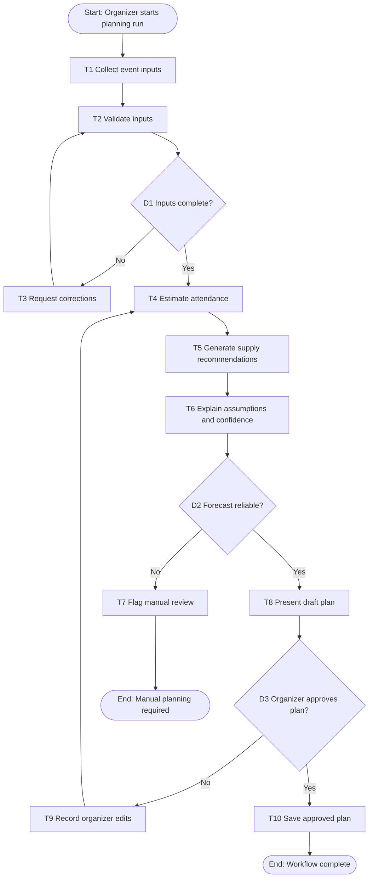
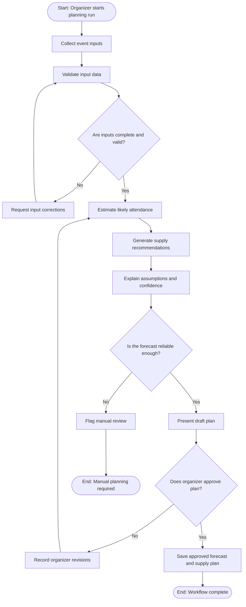

# Workflow of Tasks

*Replace all bracketed prompts with information specific to your proposed system. Delete instructional text that does not belong in your final specification. Add or remove task sections as needed. Every task shown in the general workflow must have a corresponding task specification below.*

## 1. Workflow Overview
### 1.1 Workflow Goal
This workflow supports the system goal defined in `my_first_agent/README.md`.

### 1.2 Workflow Trigger
The workflow starts when a CPVC event organizer begins an attendance-planning run for an upcoming hackathon. The organizer provides the event date, current registration total, historical attendance information, and any approved aggregate attendance signals available for that event.

### 1.3 Completion Condition at Runtime

A run is complete when the system has produced an attendance forecast, a recommended range of food, drinks, and swag, and a summary of its assumptions and confidence level. The run must also record either organizer approval of the plan or a manual-review outcome. The system does not automatically purchase supplies or send repeated messages to participants.

### 1.4 General Workflow

The organizer starts a planning run and enters the event information and approved aggregate data. The system validates that the required inputs are complete and reasonable. If information is missing or invalid, the system asks the organizer to correct it before continuing.

Using historical attendance-to-registration patterns and the available event information, the system estimates likely attendance and creates recommended quantities for food, drinks, and swag. It explains the assumptions, uncertainty, and confidence level behind the recommendation. If the data is insufficient, inconsistent, or produces an unusually uncertain forecast, the system flags the run for manual review.

The organizer reviews the draft forecast and supply plan. The organizer may approve the plan or revise the inputs and assumptions, which sends the workflow back to the estimation step. Once approved, the system saves the forecast and planning summary. It does not make purchases, use sensitive personal data, or make the final decision without organizer approval.

### 1.5 Workflow Diagram

